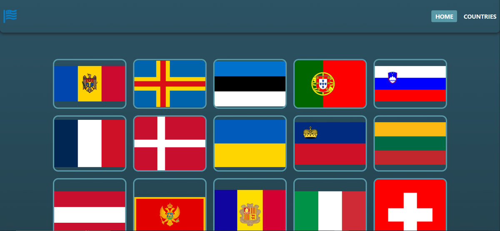

# Country Explorer – Досліджуйте країни світу 🌍

🔗 **Демо:**
[https://country-explorer-ochre-three.vercel.app/](https://country-explorer-ochre-three.vercel.app/)



## 🔎 Опис проєкту

**Country Explorer** — це сучасний вебзастосунок для зручного перегляду країн
світу. Ви можете переглядати країни за регіонами, бачити їхні прапори та швидко
отримувати потрібну інформацію.

Кожна картка країни показує прапор, а на окремій сторінці країни можна дізнатися
її назву, столицю, населення та офіційні мови. Інтуїтивний інтерфейс і
адаптивний дизайн роблять **Country Explorer** цікавим і корисним сервісом для
всіх.

Ідеально підійде тим, хто любить **географію**, **нові знання** та **подорожі**.

---

## 🌟 Основний функціонал

- 🌎 **Перегляд за регіонами**

  - Швидка фільтрація країн за континентами
  - Зручний вибір

- 🏳️ **Галерея прапорів**

  - Красива сітка національних прапорів
  - Клік для перегляду деталей

- 🗺️ **Детальна інформація**

  - Назва країни
  - Столиця
  - Населення
  - Офіційні мови
  - Високоякісний прапор

- ⚡ **Швидка навігація**
  - Миттєві переходи між сторінками
  - Без перезавантаження

---

## 🧰 Технологічний стек

### 🔨 Frontend

- **Vite** – надшвидкий інструмент збирання
- **React 18** – бібліотека UI
- **React Router DOM v7** – маршрутизація
- **Axios** – взаємодія з API

### 🎨 UI та UX

- **CSS Modules + modern-normalize** – модульні і стабільні стилі
- **react-hot-toast** – сповіщення
- **react-loader-spinner** – індикатори завантаження
- **clsx** – умовні класи

---

## 🚀 Встановлення та запуск

### 🔧 Вимоги:

- Node.js (рекомендована остання LTS-версія)
- npm або yarn

### 📦 Встановлення:

```bash
git clone https://github.com/ConstantineKobushka/country-explorer
cd country-explorer
npm install
```
